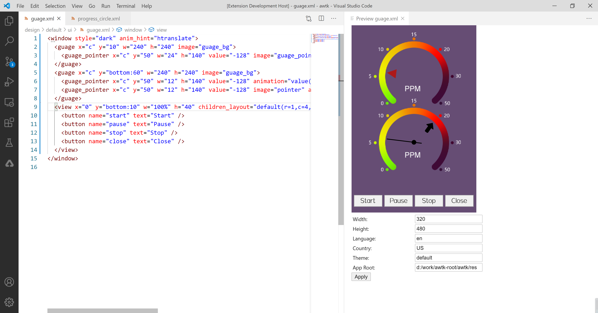
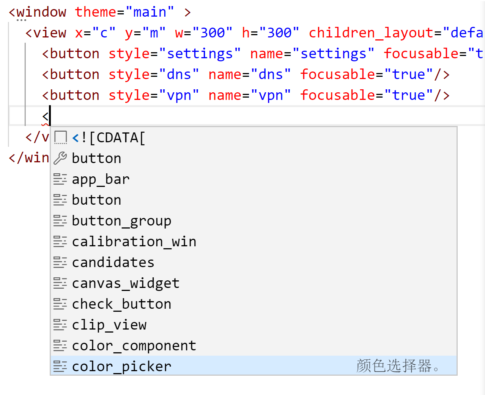
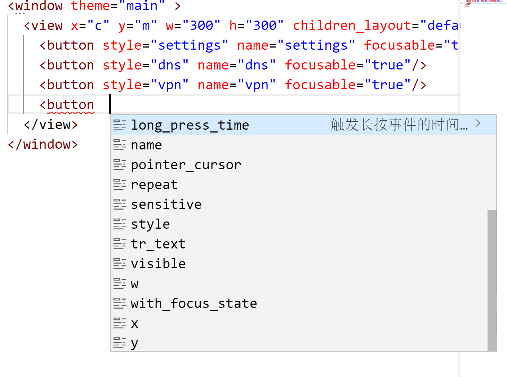

# awtk vscode plugin

## 1. 介绍

### 1.1 AWTK XML UI 预览插件

AWTK XML UI 预览插件：在 vscode 中实时预览 AWTK XML UI 文件。主要特色：

* 真实的 UI 效果。
* 可以设置主题，方便查看在不同主题下界面的效果。
* 可以设置语言，方便查看在不同语言环境下界面的效果。
* 可以设置屏幕大小，方便查看在不同屏幕大小下界面的效果。

已知问题：

* 主题切换暂未实现。
* 暂不支持自定义控件。
* 不支持 include 指令。
* 目前大概 3 秒更新一次（后续再优化）。

### 1.2 自动补全插件

智能提示控件的名称、属性和属性的取值。主要特色：

* 输入'<'时自动提示控件的 tag 名。

 

* 输入空格时提示改控件的属性名。

* 输入引号时提示改控件的取值 (TODO)。

## 2. 运行

### 2.1 运行服务

编译和运行 preview 服务，请参考 [awtk-previewer](https://github.com/zlgopen/awtk-previewer)

### 2.2 运行插件

- Open this example in VS Code 1.47+
- `npm install`
- `npm run watch` or `npm run compile`
- `F5` to start debugging

In the new vscode instance:

* Press shortcut shift+ctrl+p to activable command console

* Run the `AWTK : Preview UI XML` to create the webview.
