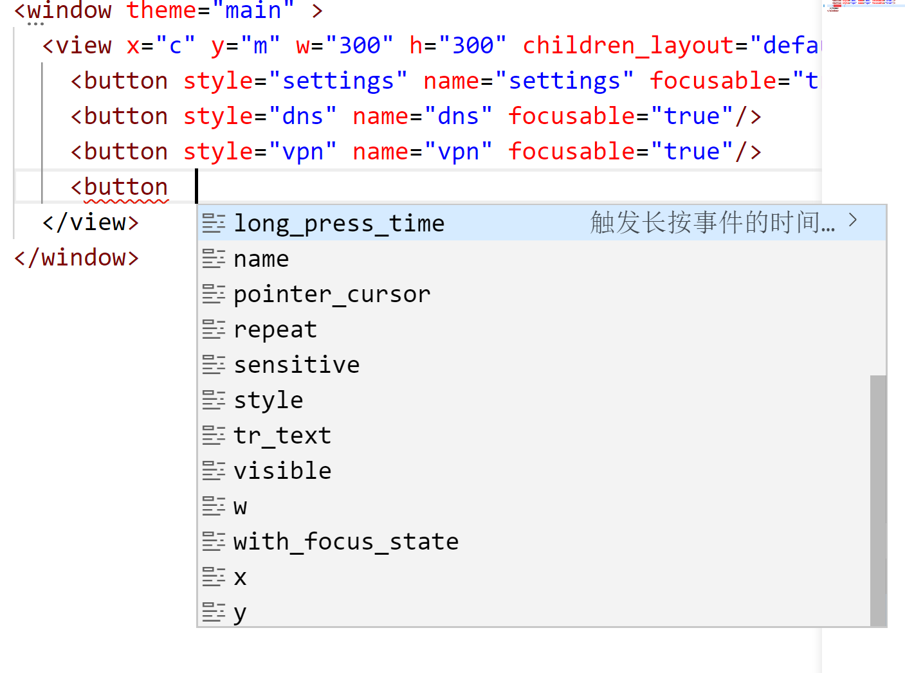

# vscode 版本的 AWTK IntelliSense 插件工作原理

## 1. 背景

之前实现了《vscode 版本的 AWTK 实时预览插件》，可以实时预览 AWTK XML UI 文件。接下来考虑的是，如何让手工编写 XML UI 文件更加容易。vscode 的 IntelliSense 对 XML 有一定的支持，但是还不够好。于是实现了一个 IntelliSense 插件，它具有下列特性：

* 1. 自动提示控件的 tag。如：

 

 * 2. 自动提示该控件的支持属性（前面以前写好的属性不再提示）。如：
 
 

 * 3. 自动提示该属性的可选值（待完善）。如：
 
 

本文接下来介绍一下这个插件的实现原理。

## 2. 插件

### 2.1 插件注册

通过函数 vscode.languages.registerCompletionItemProvider 注册 IntelliSense 插件，注册时需要指定：

* 语言。
* 处理函数。
* 触发的字符

这里的语言是 xml，并提供了三个函数：

* 输入'<'时，调用 widgetTagsCompletionProvider 对 tag 进行补全。
* 输入' '时，调用 widgetPropsCompletionProvider 对属性名称进行补全。
* 输入'"'时，调用 widgetPropValuesCompletionProvider 对属性值进行补全。

```
	context.subscriptions.push(vscode.languages.registerCompletionItemProvider('xml', widgetTagsCompletionProvider, '<'));
	context.subscriptions.push(vscode.languages.registerCompletionItemProvider('xml', widgetPropsCompletionProvider, ' '));
	context.subscriptions.push(vscode.languages.registerCompletionItemProvider('xml', widgetPropValuesCompletionProvider, '"'));
```

### 2.2 上下文相关的提示

对于 UI tag 是上下文无关的，列出全部的控件名称即可。而属性名则需要针对当前的控件，列出全部属性不但繁琐而且容易误导。属性的值也是针对当前属性名的，否则提示就没有什么意义。

所以在提供补全数据时，需要知道当前的上下文。补全函数的原型如下：

```
provideCompletionItems(document: vscode.TextDocument, position: vscode.Position) 
```

从参数里可以获取文档的内容和文档的位置，但还需要进一步处理，才能得到我们需要的上下文信息。这里用了一个简单的状态机，解析出我们需要的上下信息，比如当前的 tag，当前的属性和当前的状态。

```js
const STAT_START = 1;
const STAT_IN_TAG_NAME = 2;
const STAT_IN_PRE_TAG_NAME = 3;
const STAT_IN_PRE_PROP_NAME = 4;
const STAT_IN_PROP_NAME = 5;
const STAT_IN_PRE_PROP_VALUE = 6;
const STAT_IN_PROP_VALUE = 7;
const STAT_END = 8;

function parseTag(tagText: string | null): any {
  let result: any = {
    name: '',
    state: STAT_START,
    props: [],
  };

  if (tagText == null) {
    return null;
  }

  if (tagText == '<') {
    result.state = STAT_IN_PRE_TAG_NAME;
    return result;
  }

  let propName = '';
  let propValue = '';
  let state = STAT_START;
  let quota = '"';

  for (let i = 0; i < tagText.length; i++) {
    let c = tagText[i];
    if (c == '>') {
      break;
    }

    switch (state) {
      case STAT_START: {
        if (c === '<') {
          state = STAT_IN_PRE_TAG_NAME;
        }
        break;
      }
      case STAT_IN_PRE_TAG_NAME: {
        if (isStartID(c)) {
          state = STAT_IN_TAG_NAME;
          result.name = c;
        }
        break;
      }
      case STAT_IN_TAG_NAME: {
        if (c === ' ') {
          state = STAT_IN_PRE_PROP_NAME;
          break;
        } else {
          result.name += c;
        }
        break;
      }
      case STAT_IN_PRE_PROP_NAME: {
        if (c === '/') {
          state = STAT_END;
        } else if (isStartID(c)) {
          state = STAT_IN_PROP_NAME;
          propName = c;
        }
        break;
      }
      case STAT_IN_PROP_NAME: {
        if (c === '=') {
          state = STAT_IN_PRE_PROP_VALUE;
          result.lastPropName = propName;
        } else {
          propName += c;
        }
        break;
      }
      case STAT_IN_PRE_PROP_VALUE: {
        if (c === "'" || c === '"') {
          quota = c;
          state = STAT_IN_PROP_VALUE;
        }
        break;
      }
      case STAT_IN_PROP_VALUE: {
        if (c === quota) {
          state = STAT_IN_PRE_PROP_NAME;
          result.props[propName] = propValue;
          propName = '';
          propValue = '';
        } else {
          propValue += c;
        }
        break;
      }
      case STAT_END: {
        result.isEndTag = true;
        break;
      }
    }
  }

  result.state = state;

  return result;
}
```

> 这里解析出的上下文信息，对于 AWTK UI XML 的补全是够用了的。
>
> 对于 AWTK Style XML 还不够，因为 Style 里面的 tag 是上下文相关的。它需要解析整个文档，才能提供最理想的补全数据。出了性能和复杂度考虑，最后选择实现一个折中的方案，不过其效果还是不错的。

### 2.3 tag 补全

从 widget 列表生成 tag 的补全列表，如果是 style 文件，还需要从 widget 的状态名称生成 tag 的补全列表。

```js
export const widgetTagsCompletionProvider = {
  provideCompletionItems(document: vscode.TextDocument, position: vscode.Position) {
    let result: vscode.CompletionItem[] = [];

    if (!isAwtkUiFile(document) && !isAwtkStyleFile(document)) {
      return result;
    }

    const tagInfo = getTagInfo(document, position);
    if (tagInfo.state === STAT_IN_PRE_TAG_NAME) {
      result = result.concat(completionsFromArray(awtkUI.widgets));
      if (isAwtkStyleFile(document)) {
        result = result.concat(completionsFromArray(awtkStyle.widgetStates));
      }
    }

    return result;
  }
};
```

### 2.4 属性名补全

对于 UI 文件，需要获取当前控件的属性以及所有父类控件的属性，用它们生成补全的列表。

对于 Style 文件，通过全部的 style id 生成补全的列表。

```js
export const widgetPropsCompletionProvider = {
  provideCompletionItems(document: vscode.TextDocument, position: vscode.Position) {
    let result: vscode.CompletionItem[] = [];

    if (!isAwtkUiFile(document) && !isAwtkStyleFile(document)) {
      return result;
    }

    const tagInfo = getTagInfo(document, position);
    if (isAwtkUiFile(document)) {
      if (tagInfo.state !== STAT_IN_PRE_PROP_NAME) {
        return result;
      }

      let widgetInfo = getWidgetInfo(tagInfo.name);
      while (widgetInfo) {
        result = result.concat(completionsFromArray(widgetInfo.props));
        if (widgetInfo.parent) {
          widgetInfo = getWidgetInfo(widgetInfo.parent);
        } else {
          break;
        }
      }
    } else if (isAwtkStyleFile(document)) {
      result = result.concat(completionsFromArray(awtkStyle.styleIDs));
    }

    result = result.filter(iter => {
      let found = tagInfo.props[iter.label];

      return !found;
    });

    return result;
  }
};
```

### 2.5 属性值补全 (TODO)

属性值补全通过几个方面生成补全数据：

* 属性的类型。比如类型 bool_t 的可选值是 ["true", "false"]

* 属性的名称。比如属性 border 的可选值是 ["left", "right", "top", "bottom", "all"]

## 3. 插件的数据

这个插件是一个典型的数据驱动的插件，插件的数据主要源于 AWTK 的 idl.json 文件， idl.json 是通过工具从 AWTK 的头文件中提取出来的，包含全部 API 以及控件的描述。

用 nodejs 写了一个脚本提取需要的数据（该工具位于：awtk/tools/completion_gen):

* awtk_ui.json UI XML 的数据

* awtk_style.json Style XML 的数据
