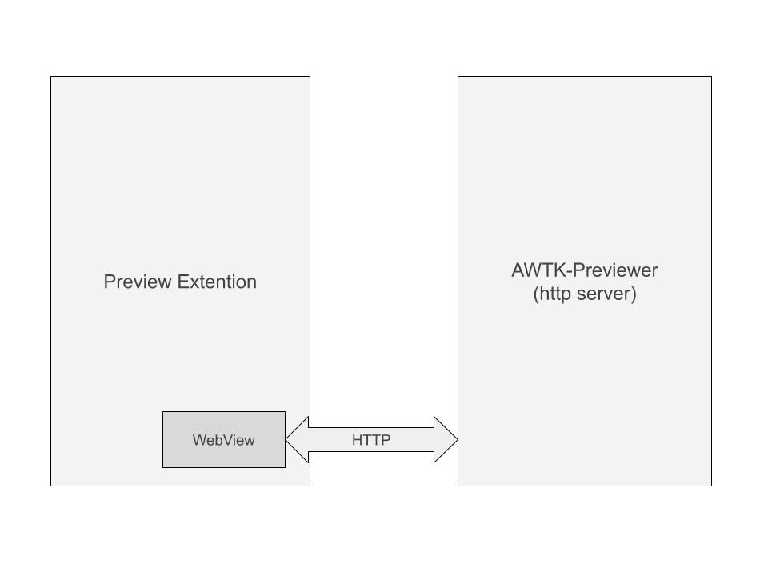

# AWTK 实时预览插件 (vscode) 工作原理

## 1. 背景

很早就计划写一个 vscode 插件来预览 AWTK 的 UI XML 文件。迟迟没有动手，主要是既不太熟悉 vscode 插件的开发，也没有想清楚这个插件的架构。如何达到期望的目标，同时保证工作量可以接受呢？

直到完成了 [AWTK 自动测试框架](https://github.com/zlgopen/awtk-ui-automation)，发现以服务的方式来实现界面预览是最好的选择：不但预览服务的工作可以重用现有的代码，而且可以保证插件本身的代码最小，以后为其它 IDE 增加预览的功能也相当简单。

在开发 [AWTK 自动测试框架](https://github.com/zlgopen/awtk-ui-automation) 时，我们顺带实现了 [AWTK RESTful HTTP 服务框架](https://github.com/zlgopen/awtk-restful-httpd) ，这使得现实一个 Restful HTTP 服务器超级简单。

> 效果大概如下图：


## 2. 工作原理

工作原理是这样的：在 vscode 中，通过命令激活 **预览** 后，如果当前文档是 AWTK XML UI 文件，就在侧边打开一个 webview，webview 读取文档的内容，并将文档内容通过 HTTP 请求发往 Preview 服务，Preview 服务在后台渲染。然后 webview 在指定的 URL 读取截图的 png 文件，并显示到 webview 中。

基本架构图：



## 3. 插件实现

### 3.1 注册命令

在插件激活时，注册一个命令，它负责打开预览的 webview。

```js
	context.subscriptions.push(
		vscode.commands.registerCommand('awtk.preview', () => {
			if (isAwtkUiFile(vscode.window.activeTextEditor)) {
				UIPreviewPanel.createOrShow(context.extensionUri);
			}
		})
	);
```

如果预览的 webview 已经存在则更新它，否则创建一个新的 webview。始终在侧边创建，需要使用参数 vscode.ViewColumn.Two。

### 3.2 创建 webview
```js
	public static createOrShow(extensionUri: vscode.Uri) {
		const column = vscode.ViewColumn.Two;

		if (UIPreviewPanel.currentPanel) {
			UIPreviewPanel.currentPanel._panel.reveal(column);
			UIPreviewPanel.currentPanel.update();
			return;
		} else {
			const panel = vscode.window.createwebviewPanel(
				UIPreviewPanel.viewType, 'AWTK UI Previewer', column,
				{
					enableScripts: true,
				}
			);
			UIPreviewPanel.currentPanel = new UIPreviewPanel(panel, extensionUri);
		}
	}
```

### 3.3 webview 的 HTML 文件

这个很简单：一个 image 对象来显示预览的效果，还有一些设置和提交设置的按钮。值得一提的是用了一个隐藏的 input 来保存 XML 内容。

```js
	private _getHtmlForwebview(webview: vscode.webview, source: string, appRoot: string) {
		const scriptPathOnDisk = vscode.Uri.joinPath(this._extensionUri, 'media', 'main.js');
		const scriptUri = webview.aswebviewUri(scriptPathOnDisk);
		const escapeSource = escape(source);
		const nonce = getNonce();

		return `<!DOCTYPE html>
			<html lang="en">
			<head>
				<meta charset="UTF-8">
				<meta name="viewport" content="width=device-width, initial-scale=1.0">
				<title>UI Preview</title>
			  <script nonce="${nonce}" src="${scriptUri}"></script>
			</head>
			<body>
			<image id="screenshot"/>
			<table style="width: 100%;">
				<tr><td>Width:</td><td><input type="text" id="width" value="320"></td></tr>
				<tr><td>Height:</td><td><input type="text" id="height" value="480"></td></tr>
				<tr><td>Language:</td><td><input type="text" id="language" value="en"></td></tr>
				<tr><td>Country:</td><td><input type="text" id="country" value="US"></td></tr>
				<tr><td>Theme:</td><td><input type="text" id="theme" value="default"></td></tr
				<tr><td>App Root:</td><td><input type="text" id="app_root" value="${appRoot}"></td></tr>
			</table>
      <input id="source" type="hidden" value="${escape(source)}" >
      <input id="apply" type="submit" value="Apply">
			</body>
			</html>`;
	}
```

### 3.4 webview 的 JS 文件

它的主要职责是在 UI 文件内容变化时，向 preview 服务发送请求。为了保存发送不会过于频繁，在上一个请求完成后才发起新的请求。

```js
function clientUpdateUI(escapedXml, app_root, width, height, language, country, theme) {
  const xml = unescape(escapedXml);

  const reqJson = {
    xml: xml,
    app_root: app_root,
    width: width,
    height: height,
    language: language,
    country: country,
    theme: theme
  }

  console.log(reqJson);

  try {
    const parser = new DOMParser();
    const xmlDoc = parser.parseFromString(xml, "text/xml");
    reqJson.xml = xmlDoc.documentElement.outerHTML;

    if (reqJson.xml.indexOf('parsererror') > 0) {
      console.log("invalid ui xml:", reqJson.xml);
      screenshot.width = width;
      screenshot.height = height;

      screenshot.src = "http://localhost:8000/screenshot?timestamp=" + Date.now();

      return;
    }
  } catch (e) {
    console.log("invalid ui xml", e);
    return;
  }

  const req = JSON.stringify(reqJson, null, '\t');

  function onRequestResult() {
    const screenshot = document.getElementById('screenshot');
    const width = document.getElementById('width').value;
    const height = document.getElementById('height').value;

    screenshot.width = width;
    screenshot.height = height;
    screenshot.onload = function () {
      s_pendingLoad = false;
      console.log("screen shot loaded");
      return;
    }
    s_pendingLoad = true;
    screenshot.src = "http://localhost:8000/screenshot?timestamp=" + Date.now();

    console.log(this.responseText);
  }

  let oReq = new XMLHttpRequest();
  oReq.addEventListener("load", onRequestResult);
  oReq.open("POST", "http://localhost:8000/ui");
  oReq.send(req);

  return;
}

```

### 3.5 XML UI 文件更新事件处理

注册文档变化事件，如果是当前预览的文档，向 webview 发送 updateSource 事件：

```js
	context.subscriptions.push(vscode.workspace.onDidChangeTextDocument(e => {
		let uri = e.document.uri.toString();
		if (UIPreviewPanel.currentPanel) {
			const doc = e.document;
			let source = doc.getText();

			if (UIPreviewPanel.currentPanel.uri == uri) {
				UIPreviewPanel.currentPanel.updateSource(source);
			}
		}
	})
	);

...
	public updateSource(source: string) {
		this._panel.webview.postMessage({ type: 'updateSource', source: source });
	}
```

webview 里设置变化的标识，在下一次定时任务中发送更新请求。

```js
  window.addEventListener('message', event => {
    const message = event.data; // The json data that the extension sent
    switch (message.type) {
      case 'updateSource':
        {
          console.log('updateSource:', message);
          const source = document.getElementById('source');
          if (source.value != message.source) {
            source.value = message.source;
            s_pendingUpdate++;
          } else {
            console.log('not changed')
          }
          break;
        }
      default: break;
    }
	});
```

## 4. 服务实现

在 preview 服务中，实现了两个请求：

* 1. 用于更新设置和 XML。
* 2. 用于获取预览的效果图。

```c
static const http_route_entry_t s_ui_preview_routes[] = {
    {HTTP_POST, "/ui", ui_preview_on_update_ui},
    {HTTP_GET, "/screenshot", ui_preview_on_get_screenshot}};

ret_t ui_preview_start(int port) {
  httpd_t* httpd = httpd_create(port, 1);
  return_value_if_fail(httpd != NULL, RET_BAD_PARAMS);

  httpd_set_routes(httpd, s_ui_preview_routes, ARRAY_SIZE(s_ui_preview_routes));
  httpd->user_data = app_info_create();

  s_httpd = httpd;
  return httpd_start(httpd);
}
```

> 详细实现请参考 [awtk-previewer](https://github.com/zlgopen/awtk-previewer)

## 5. 其它问题

对于实时预览，比较麻烦的问题是：当前的 XML 可能是无效的，无效体现在两个方面：

* XML 本身不是 welform 的。这个我们可以通过 DOMParser 进行解析，如果失败，并不更新 XML。

```js
    const parser = new DOMParser();
    const xmlDoc = parser.parseFromString(xml, "text/xml");
    reqJson.xml = xmlDoc.documentElement.outerHTML;

    if (reqJson.xml.indexOf('parsererror') > 0) {
      console.log("invalid ui xml:", reqJson.xml);
      screenshot.width = width;
      screenshot.height = height;

      screenshot.src = "http://localhost:8000/screenshot?timestamp=" + Date.now();

      return;
    }
```

* XML 是 welform 的，但是某些值是无效的。比如：

比如输入 label 时，刚输人 l，这并不是一个有效的控件名称，它会触发 AWTK 的 assert，让 preview 服务奔溃。

```xml
<l />
```

为此需要修改 AWTK，去掉 assert，打印一个警告就好了，同时创建一个 view 控件，临时代替未知控件。